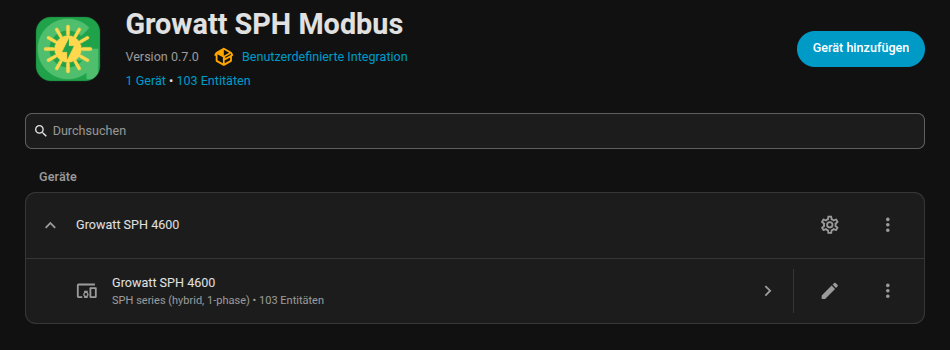
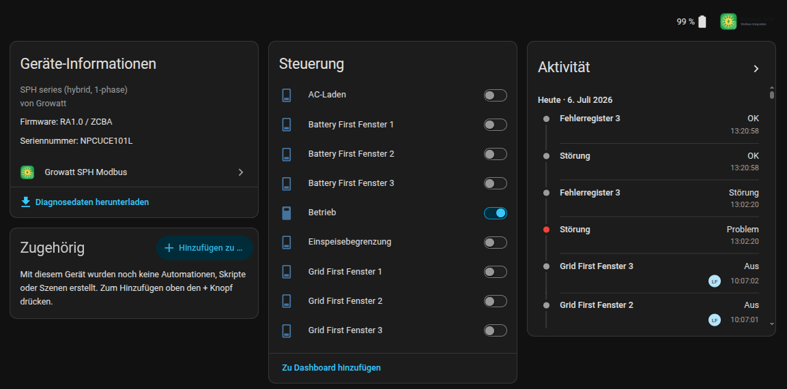
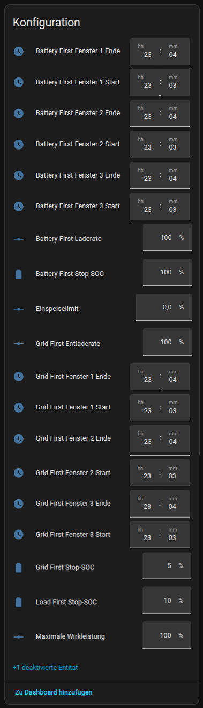
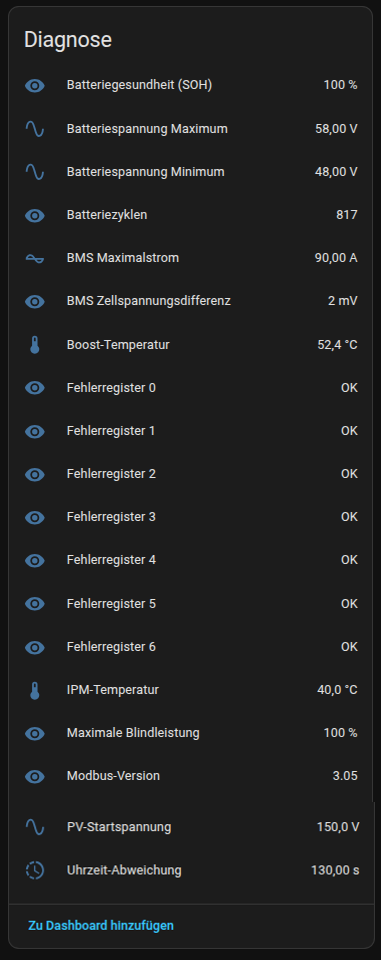
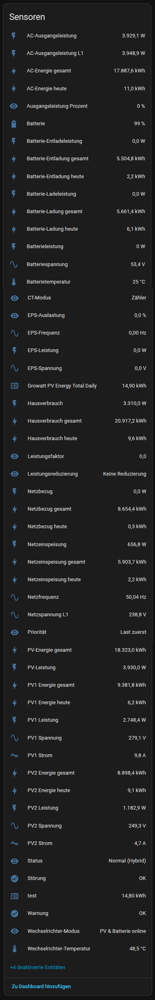
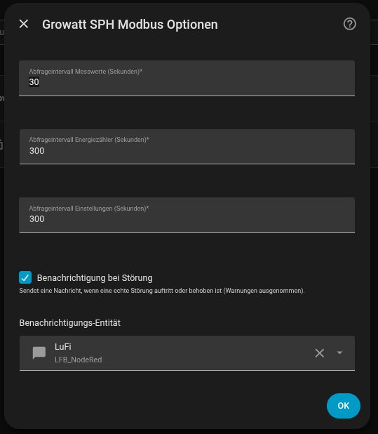

# Growatt SPH Modbus for Home Assistant

Local Modbus integration for Growatt hybrid inverters (SPH / SPH TL3 series) — no cloud, no ShineServer.

*Lokale Modbus-Integration für Growatt-Hybrid-Wechselrichter (SPH / SPH TL3) — ohne Cloud, ohne ShineServer. Deutsche Beschreibung weiter unten.*

## Features

- **Serial RTU** (RS485/USB adapter) and **Modbus TCP** (RS485-to-Ethernet gateways)
- **Automatic inverter detection**: device type code and tracker/phase count are read from holding registers 43/44, selecting the correct profile (1-phase SPH vs. 3-phase SPH TL3) automatically — manual override available
- **Multiple inverters**: add one config entry per inverter; several slave IDs can share the same RS485 bus or TCP gateway
- **Efficient polling**: registers are read in blocks (6 transactions per cycle instead of ~90 single reads)
- **Multilingual**: English and German UI, translated enum states (status, priority, derating, ...)
- **65+ entities** per inverter: PV, grid (per-phase on TL3), battery, EPS, energy counters, temperatures, fault registers
- **Writable settings**: power on/off (switch), priority Load/Battery/Grid (select), minimum discharge SoC and maximum active power (numbers)
- **Extensible profiles**: register maps live in `registers.py`; adding another Growatt series (MIN, MOD, SPA, MAX, ...) only requires a new `DeviceProfile`
- Diagnostics download with raw register dump for easy debugging

## Screenshots

<table>
<tr>
<td align="center" width="50%">

**Integration overview**

</td>
<td align="center" width="50%">

**Device page — control & activity**

</td>
</tr>
<tr>
<td align="center" width="50%">

**Configuration**

</td>
<td align="center" width="50%">

**Diagnostics**

</td>
</tr>
</table>

**All sensors**

**Options dialog**

## Supported devices

| Profile | Devices | Notes |
|---|---|---|
| SPH (1-phase) | SPH 3000-6000 | tested on SPH 4600 |
| SPH TL3 (3-phase) | SPH 4000-10000 TL3 BH(-UP) | adds per-phase grid/EPS sensors, untested — feedback welcome |

Based on the official protocol documents "Growatt PV Inverter Modbus RS485 RTU Protocol" V1.20 and V3.05. Note that Growatt's documents are only partially accurate; the registers used here were verified against real hardware.

## Installation

### HACS (recommended)

1. HACS → Integrations → ⋮ → *Custom repositories* → add this repository (category *Integration*)
2. Install **Growatt Modbus** and restart Home Assistant

### Manual

Copy `custom_components/growatt_modbus` into your `config/custom_components/` folder and restart.

## Setup

*Settings → Devices & services → Add integration → Growatt Modbus*

Choose the connection type:

| Serial (RTU) | TCP |
|---|---|
| Serial port, e.g. `/dev/serial/by-id/...` | Host / IP of the gateway |
| Baud rate (default 9600) | Port (default 502) |
| Slave ID (default 1) | Slave ID (default 1) |

For a second inverter simply add the integration again with the other slave ID (same port/host is fine — the bus is shared safely).

The polling interval (default 30 s) can be changed under *Configure* on the integration entry.

> **Important:** the serial port must not be used by another integration (e.g. the built-in `modbus:` YAML integration) at the same time.

## Register map

Based on the Growatt Modbus RTU protocol V1.20 for SPH storage inverters. Fault registers 1001–1007 are decoded bit by bit; active fault names are shown in the `active_faults` attribute.

---

## Deutsch

Lokale Anbindung von Growatt-Hybrid-Wechselrichtern (SPH / SPH TL3) über Modbus — seriell (RS485/USB) oder Modbus TCP.

- **Automatische Erkennung**: Gerätetyp und Phasenzahl werden aus den Holding-Registern 43/44 gelesen; das passende Profil (1-phasiger SPH oder 3-phasiger SPH TL3) wird automatisch gewählt, manuelle Auswahl bleibt möglich
- **Mehrere Wechselrichter**: pro Wechselrichter ein Eintrag; mehrere Slave-IDs können sich denselben RS485-Bus teilen
- **Effizient**: Registerblöcke statt Einzelabfragen
- **Zweisprachig**: Deutsch und Englisch, inklusive übersetzter Zustände
- **Schreibbare Einstellungen**: Ein/Aus, Priorität (Last/Batterie/Netz), minimaler Entlade-SOC, maximale Wirkleistung
- **3-phasige TL3-Geräte**: zusätzliche Sensoren je Phase (Netzspannung/-leistung L1–L3, Außenleiterspannungen, EPS je Phase) — ungetestet, Rückmeldungen willkommen

Einrichtung über *Einstellungen → Geräte & Dienste → Integration hinzufügen → Growatt Modbus*. Für einen zweiten Wechselrichter die Integration einfach erneut mit anderer Slave-ID hinzufügen. Das Abfrageintervall lässt sich unter *Konfigurieren* ändern.

> **Wichtig:** Der serielle Port darf nicht gleichzeitig von einer anderen Integration (z. B. der `modbus:`-YAML-Integration) verwendet werden.

## License

MIT
